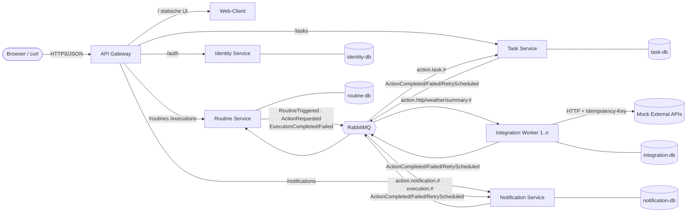
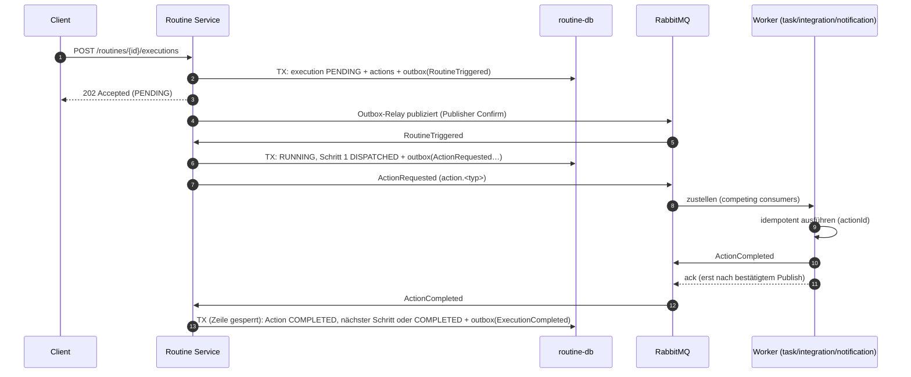

# Architektur

Dieses Dokument beschreibt die Umsetzung der in der [README](../README.md) beschriebenen Plattform.

## 1. Überblick



Alle Services, Datenbanken, der Broker und Jaeger werden mit **einem** Befehl gestartet: `docker compose up -d --build --wait`.

Der Web-Client ist ein eigener Service mit eigenem Build und Deployment. Das Gateway leitet alle Nicht-API-Pfade an ihn weiter –
der Browser sieht dadurch nur einen Origin (kein CORS), und der Client teilt keinen Code mit den Services (eigene Typen in `web/src/types.ts`).

## 2. Service-Zuschnitt

| Service | Verantwortung | Daten (eigene DB) | Schnittstellen |
| --- | --- | --- | --- |
| **gateway** | Einziger Einstiegspunkt, Routing, Token-Prüfung am Rand, Correlation-ID, Systemstatus | – (stateless) | HTTP |
| **web** | Web-Client (React + Vite, von nginx ausgeliefert); spricht ausschliesslich über das Gateway mit der API | – (statisch) | HTTP |
| **identity-service** | Benutzer, Login, Ausstellen von RS256-Tokens, JWKS | `users`, `signing_keys` | HTTP |
| **routine-service** | Routinen verwalten, Ausführungen orchestrieren, Zeitplan, Status | `routines`, `executions`, `execution_actions`, `execution_log`, `outbox` | HTTP, publiziert Commands/Events, konsumiert Ergebnisse |
| **task-service** | Aufgaben-System; führt `task.create` aus | `tasks` | HTTP, konsumiert Actions |
| **notification-service** | Posteingang; führt `notification.send` aus, reagiert auf Execution-Events | `notifications` | HTTP, konsumiert Actions + Events |
| **integration-worker** | Stateless Worker für externe Aufrufe (`weather.get`, `http.request`, `summary.generate`), **horizontal skalierbar** | `action_executions` (Idempotenz) | nur Broker (+ Health) |
| **mock-external** | *Nicht Teil der Plattform* – simuliert Drittanbieter (Latenz, 503, Webhooks) | – (in-memory) | HTTP |

**Warum so geschnitten?** Jeder Service entspricht einer fachlichen Fähigkeit (Bounded Context). Der Routine Service
kennt Action-*Typen*, aber nicht, *wer* sie ausführt: er publiziert `ActionRequested` mit Routing-Key `action.<typ>`;
welche Queue die Nachricht erhält, bestimmen allein die Broker-Bindings. Ein neuer Action-Typ bzw. Service erfordert
also nur ein neues Binding – kein Deployment des Routine Service (ausser dem Katalog-Eintrag für die Validierung).

## 3. Kommunikation

| Von → Nach | Art | Wofür |
| --- | --- | --- |
| Client → Gateway → Services | synchron HTTP | Benutzeranfragen, CRUD, Status, Login |
| Services → identity-service (JWKS) | synchron HTTP, gecacht | Token-Prüfung (nur Schlüsselabruf, nicht pro Request) |
| routine-service → Worker | asynchron, **Command** `ActionRequested` (Topic `routine.actions`) | Ausführung einer Action |
| Worker → routine-service | asynchron, **Event** `ActionCompleted/Failed/RetryScheduled` | Ergebnis melden |
| routine-service → alle | asynchron, **Event** `ExecutionCompleted/Failed` (pub/sub) | Notification Service reagiert, ohne dass der Producer ihn kennt |
| routine-service → routine-service | asynchron `RoutineTriggered` | Auslösen ist schnell und funktioniert auch ohne Broker (Outbox) |

Die Verträge liegen in [`contracts/`](../contracts/README.md) (OpenAPI 3.1, AsyncAPI 3.0, JSON Schema).

### Orchestrierung statt Choreografie

Eine Routine hat Schritte, Abhängigkeiten und Datenfluss (`{{actions.weather.summary}}`). Diese Logik liegt
zentral im Routine Service (Orchestrator); die Worker bleiben einfach und kennen einander nicht. Die Execution
ist dadurch jederzeit an einer Stelle abfragbar. Reine Benachrichtigungen (`ExecutionCompleted`) sind dagegen
choreografiert – beliebig viele Consumer können sie abonnieren.

## 4. Ablauf einer Execution



Zustände: `PENDING → RUNNING → COMPLETED`, `RUNNING ⇄ WAITING` (Retry geplant oder kein Worker antwortet innert
`WAITING_AFTER_MS`), `→ FAILED` bei permanentem Fehler. Die Übergänge sind als reine Funktion in
`services/routine-service/src/domain/progress.ts` implementiert und unit-getestet.

## 5. Zuverlässigkeit

| Problem | Lösung | Ort |
| --- | --- | --- |
| Zustand gespeichert, aber Nachricht verloren (Dual Write) | **Transactional Outbox**: Nachricht wird in derselben DB-Transaktion geschrieben und vom Relay publiziert | `routine-service/src/outbox.ts` |
| Broker nimmt Nachricht nicht an | Publisher Confirms; Outbox-Zeile bleibt offen, bis bestätigt | `service-kit/src/broker.ts` |
| Consumer stürzt während Verarbeitung ab | Manuelles `ack` erst nach Erfolg → Broker stellt erneut zu | `broker.ts` |
| Consumer ist gestoppt | Durable Quorum Queues aus `definitions.json` existieren unabhängig vom Consumer; Nachrichten warten | `infra/rabbitmq/` |
| Doppelte Zustellung | **Idempotente Consumer**, Schlüssel `actionId`: Unique-Constraint (`tasks.source_action_id`, `notifications.source_key`) bzw. Claim-Tabelle mit Lease (`action_executions`). Duplikate lösen keine zweite Wirkung aus, das gespeicherte Ergebnis wird erneut gemeldet | Worker |
| Doppelte Ergebnisse / parallele Ergebnisse | Execution-Zeile `FOR UPDATE` gesperrt; bereits abgeschlossene Actions ignorieren weitere Ergebnisse | `engine.ts` |
| Client wiederholt POST | Header `Idempotency-Key` → gleiche Execution | `api.ts` |
| Transiente Fehler (503, Timeout) | **Retry mit Backoff** 1 s → 5 s → 15 s über Retry-Queues (TTL + Dead-Lettering zurück), Execution meldet `WAITING` | `broker.ts` |
| Permanente Fehler (4xx, ungültige Params) | Kein Retry → `ActionFailed` → Execution `FAILED`; Nachricht in `<queue>.dlq` zur Analyse | Worker |
| Poison Messages / Crash-Loops | Quorum-Queue `x-delivery-limit: 10` → DLQ | `definitions.json` |
| Broker-Neustart | `amqp-connection-manager` verbindet neu und registriert Consumer automatisch | `broker.ts` |
| Mehrere Scheduler-Replikas | `FOR UPDATE SKIP LOCKED` + `UNIQUE (routine_id, scheduled_for)` | `scheduler.ts` |
| Externe Seiteneffekte doppelt | `Idempotency-Key: <actionId>` an externe APIs | `integration-worker/src/actions.ts` |

**Garantie:** at-least-once-Zustellung + idempotente Verarbeitung = *effectively once*.

## 6. Skalierung

Der integration-worker ist stateless (Zustand nur in der eigenen DB). Replikas konsumieren dieselbe Queue
(*competing consumers*); `prefetch = 1` sorgt für faire Verteilung. Skalieren ohne Konfigurationsänderung:

```bash
docker compose up -d --scale integration-worker=5
```

Auch routine-service, task-service und notification-service könnten mehrfach laufen: alle Hintergrundprozesse
(Outbox-Relay, Scheduler, Migrationen) sind über `SKIP LOCKED` bzw. Advisory Locks replikasicher.

## 7. Observability

* **Strukturierte Logs** (pino, JSON) mit `service`, `instance`, `correlationId`, `executionId`, `actionId`,
  `trace_id`. Die Correlation-ID entsteht im Gateway (`X-Correlation-Id`), wird in der Execution gespeichert
  und reist im Envelope jeder Nachricht mit. `scripts/demo.sh trace <id>` zeigt die Logs aller Services zu einer Ausführung.
* **Distributed Tracing** mit OpenTelemetry → Jaeger (http://localhost:16686). Der W3C-`traceparent` wird über
  HTTP und AMQP-Header propagiert; das Outbox-Relay stellt den beim Schreiben gespeicherten Trace-Kontext wieder
  her. Eine manuelle Ausführung ergibt so **einen** Trace über Gateway, Routine Service, Broker, alle Worker und
  den externen Dienst.
* **Health/Readiness**: `/health` (Liveness, für Docker) und `/ready` (DB + Broker).
* **Systemstatus** im UI (Seite *System*: Live-Topologie mit Queue-Tiefen und Consumern) bzw. `scripts/demo.sh status`.
  Quorum Queues melden ihre Metriken auf einem eigenen Tick – `infra/rabbitmq/advanced.config` setzt ihn auf 1 s.
* **Trace pro Execution**: jede Ausführung speichert ihre `traceId` (auch zeitgesteuerte – der Scheduler startet dafür einen
  eigenen Span). Das UI verlinkt direkt auf den Trace in Jaeger.

## 8. Security

* Eigenständiger **Identity Service** stellt RS256-JWTs aus; der private Schlüssel verlässt ihn nie.
* Gateway **und** jeder Service prüfen das Token selbst (Defense in Depth) anhand des öffentlichen JWKS.
* **Mandantentrennung**: jede Abfrage filtert nach `owner_id = sub`; fremde Ressourcen liefern 404.
* Passwörter mit scrypt gehasht; identische Antwort bei unbekanntem Benutzer und falschem Passwort.
* `http.request` nur an Hosts der Allow-List (`HTTP_ALLOWED_HOSTS`) → kein SSRF auf interne Services.
* Services und Datenbanken sind nicht vom Host erreichbar – nur das Gateway (plus Werkzeuge für die Demo).

## 9. Schnittstellen-Evolution

`ExecutionCompleted` wird von v1 (`message`) zu v2 (`notification{title,body}`, `priority`) weiterentwickelt:

| Phase | routine-service (`EXECUTION_COMPLETED_FORMAT`) | notification-service (`COMPLETION_EVENT_READER`) |
| --- | --- | --- |
| 1. Ausgangslage | `v1` | `legacy` |
| 2. Expand | `expand` (alte **und** neue Felder) | `legacy` – funktioniert weiter |
| 3. Consumer aktualisieren | `expand` | `tolerant` (bevorzugt v2, fällt auf v1 zurück) |
| 4. Contract | `v2` (altes Feld entfernt) | `tolerant` |

Pro Phase wird genau **ein** Service neu deployt. Der Breaking Change (Phase 1 → 4 direkt) wird ebenfalls
demonstriert: der Legacy-Consumer lehnt das Event als permanent fehlerhaft ab, es landet in der DLQ (nicht verloren)
und kann nach dem Consumer-Update mit `scripts/replay-dlq.sh` erneut eingespielt werden. Contract-Tests prüfen jede
Phase gegen die JSON Schemas.

## 10. Technologie-Entscheide (ADR-Kurzform)

| Entscheid | Begründung | Alternative |
| --- | --- | --- |
| TypeScript auf Node 24 (Type Stripping, kein Build-Schritt) | Schnelle Iteration, gute Libraries für AMQP/OTel | Java/Spring, .NET |
| RabbitMQ 4 (Quorum Queues) | Commands mit Routing, Acks, DLX/TTL für Retries, Management-UI für die Demo | Kafka (Log statt Queue, Retries aufwändiger) |
| PostgreSQL pro Service | Autonome Daten, Transaktionen für Outbox & Idempotenz | gemeinsame DB (verletzt Autonomie) |
| Orchestrierung im Routine Service | Schritte, Abhängigkeiten, Datenfluss, zentraler Status | reine Choreografie |
| Topologie als Code (`definitions.json`) | Queues existieren, bevor Consumer laufen → kein Nachrichtenverlust | Consumer deklarieren Queues selbst |
| Web-Client als eigener Service (React, Vite, nginx) | UI unabhängig baubar/deploybar; nginx liefert statische Dateien effizient aus | UI im Gateway ausliefern |
| Service-Kit als technisches Chassis | Logging, Broker, DB, Auth einheitlich; **keine Domain-Modelle** geteilt | Code-Duplikation in jedem Service |
| Monorepo | Einfache Abgabe; jeder Service hat trotzdem eigenes Image & Deployment | Repo pro Service |

## 11. Bewusste Grenzen

* Kein produktionsreifes Secret-Management (Passwörter in `compose.yaml`), kein TLS.
* Jaeger speichert Traces nur im Speicher.
* Die Retry-Queues verwenden eine TTL pro Queue (eine Queue je Backoff-Stufe), damit kein Head-of-Line-Blocking entsteht.
* Scheduler holt verpasste Läufe (Service war down) einmal nach, nicht jeden einzelnen verpassten Slot.
