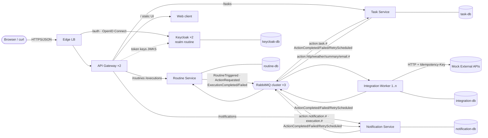
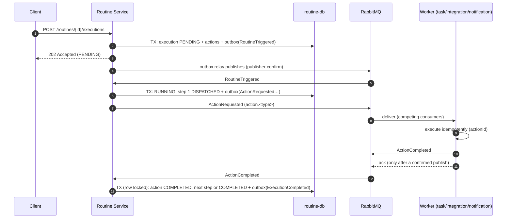
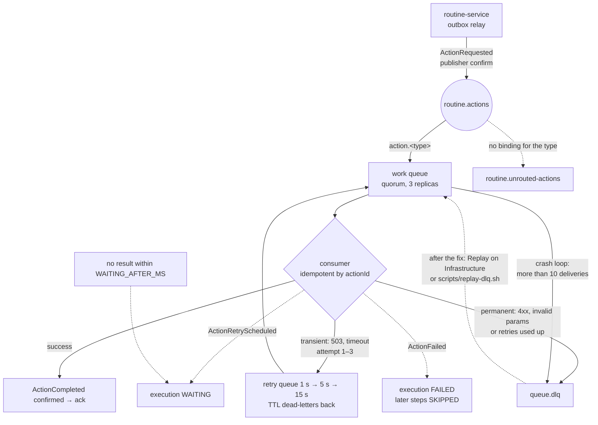
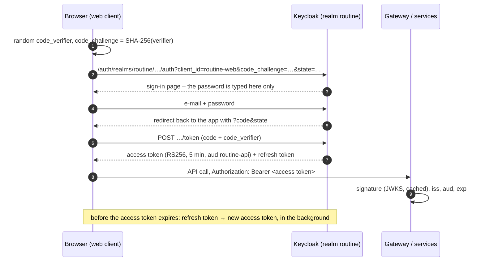

# Architecture

This document describes how the platform outlined in the [README](../README.md) is implemented.

## 1. Overview


```mermaid
flowchart LR
    Client([Browser / curl]) -->|HTTPS/JSON| EDGE[Edge LB] --> GW[API Gateway ×2]
    EDGE -->|/auth · OpenID Connect| KC[Keycloak ×2<br/>realm routine]
    GW -->|/ static UI| WEB[Web client]
    GW -. token keys JWKS .-> KC
    GW -->|/routines /executions| RS[Routine Service]
    GW -->|/tasks| TS[Task Service]
    GW -->|/notifications| NS[Notification Service]

    RS -- "RoutineTriggered · ActionRequested\nExecutionCompleted/Failed" --> MB{{RabbitMQ cluster ×3}}
    MB -- "action.task.#" --> TS
    MB -- "action.http/weather/summary/email.#" --> IW1[Integration Worker 1..n]
    MB -- "action.notification.# · execution.#" --> NS
    TS & IW1 & NS -- "ActionCompleted/Failed/RetryScheduled" --> MB
    MB --> RS
    IW1 -->|HTTP + Idempotency-Key| EXT[(Mock External APIs)]

    KC --- KCDB[(keycloak-db)]
    RS --- RSDB[(routine-db)]
    TS --- TSDB[(task-db)]
    NS --- NSDB[(notification-db)]
    IW1 --- IWDB[(integration-db)]
```

All services, databases, the broker and Jaeger start with **one** command: `docker compose up -d --build --wait`.
Every platform service runs as two replicas and the broker as a three-node cluster, so no single container is
required. See [availability.md](availability.md) for the single-point-of-failure analysis.

The web client is a service of its own, with its own build and deployment. The gateway forwards every non-API path to it –
so the browser only ever sees one origin (no CORS), and the client shares no code with the services (its own types live in `web/src/types.ts`).

## 2. Service boundaries

| Service | Responsibility | Data (own DB) | Interfaces |
| --- | --- | --- | --- |
| **edge** | Load balancer on the public port, spreads requests over the gateway replicas; config only (nginx) | – (stateless) | HTTP |
| **gateway** | Single entry point, routing, token check at the edge, correlation ID, system status | – (stateless) | HTTP |
| **web** | Web client (React + Vite, served by nginx); talks to the API only through the gateway | – (static) | HTTP |
| **keycloak** | Identity provider (Keycloak 26, *configured*, not written by us): users, sign-in and registration pages, tokens, keys. Realm `routine` as code: `infra/keycloak/realm-routine.json` | its own `keycloak-db` | OpenID Connect over HTTP |
| **routine-service** | Manages routines, orchestrates executions, schedule, status | `routines`, `executions`, `execution_actions`, `execution_log`, `outbox` | HTTP, publishes commands/events, consumes results |
| **task-service** | Task system with lists; executes `task.create` | `tasks`, `task_lists` | HTTP, consumes actions |
| **notification-service** | Inbox; executes `notification.send`, reacts to execution events | `notifications` | HTTP, consumes actions + events |
| **integration-worker** | Stateless worker for external calls (`weather.get`, `http.request`, `summary.generate`, `email.send`), **horizontally scalable** | `action_executions` (idempotency) | broker only (+ health) |
| **trigger-service** (v2) | Starts event-triggered routines: keeps a projection of them (`RoutineSaved` / `RoutineDeleted`), matches every domain and execution event against their filters, guards against loops, sends `StartRoutineRequested` – never creates executions itself | `subscriptions`, `match_log`, `outbox` | HTTP (`/api/v1/triggers`), consumes events, publishes commands |
| **mock-external** | *Not part of the platform* – simulates third-party services (latency, 503, webhooks) | – (in-memory) | HTTP |

**Why this split?** Each service corresponds to one business capability (bounded context). The routine service
knows action *types* but not *who* executes them: it publishes `ActionRequested` with the routing key `action.<type>`,
and the broker bindings alone decide which queue receives the message. A new action type or service therefore only
needs a new binding – no deployment of the routine service (apart from the catalogue entry used for validation).

## 3. Communication

| From → to | Kind | Purpose |
| --- | --- | --- |
| Client → gateway → services | synchronous HTTP | user requests, CRUD, status, login |
| Browser ↔ Keycloak (via the edge, `/auth`) | OpenID Connect, Authorization Code + PKCE | sign-in, registration, token renewal |
| Services → Keycloak (JWKS) | synchronous HTTP, cached | token verification (key fetch only, not per request) |
| routine-service → workers | asynchronous **command** `ActionRequested` (topic `routine.actions`) | executing an action |
| Workers → routine-service | asynchronous **event** `ActionCompleted/Failed/RetryScheduled` | reporting a result |
| routine-service → everyone | asynchronous **event** `ExecutionCompleted/Failed` (pub/sub) | the notification service reacts without the producer knowing it |
| routine-service → routine-service | asynchronous `RoutineTriggered` | triggering is fast and works even without the broker (outbox) |
| External system → gateway → routine-service | synchronous HTTP, public `POST /api/v1/hooks/{token}` | an external event starts a routine; the JSON body is available to its steps as `{{trigger.body.…}}` |

The contracts live in [`contracts/`](../contracts/README.md) (OpenAPI 3.1, AsyncAPI 3.0, JSON Schema).

### Orchestration rather than choreography

A routine has steps, dependencies and data flow (`{{actions.weather.summary}}`). This logic sits centrally in the
routine service (the orchestrator); the workers stay simple and do not know about each other. As a result, an execution
can be queried in one place at any time. Pure notifications (`ExecutionCompleted`), on the other hand, are
choreographed – any number of consumers can subscribe to them.

## 4. Lifecycle of an execution


```mermaid
sequenceDiagram
    autonumber
    participant C as Client
    participant R as Routine Service
    participant DB as routine-db
    participant B as RabbitMQ
    participant W as Worker (task/integration/notification)
    C->>R: POST /routines/{id}/executions
    R->>DB: TX: execution PENDING + actions + outbox(RoutineTriggered)
    R-->>C: 202 Accepted (PENDING)
    R->>B: outbox relay publishes (publisher confirm)
    B->>R: RoutineTriggered
    R->>DB: TX: RUNNING, step 1 DISPATCHED + outbox(ActionRequested…)
    R->>B: ActionRequested (action.<type>)
    B->>W: deliver (competing consumers)
    W->>W: execute idempotently (actionId)
    W->>B: ActionCompleted
    W-->>B: ack (only after a confirmed publish)
    B->>R: ActionCompleted
    R->>DB: TX (row locked): action COMPLETED, next step or COMPLETED + outbox(ExecutionCompleted)
```

States: `PENDING → RUNNING → COMPLETED`, `RUNNING ⇄ WAITING` (retry scheduled, or no worker answers within
`WAITING_AFTER_MS`), `→ FAILED` on a permanent error. The transitions are implemented as a pure function in
`services/routine-service/src/domain/progress.ts` and unit-tested.

### Scripting: variables, conditions, loops

Modelled on the *Scripting* actions of Apple's Shortcuts, without changing the state machine above:

- **Scripting actions** (`variable.set`, `condition.if`, `math.calculate`) only compute a value from their
  resolved params. The engine evaluates them itself (`domain/control.ts`, pure and unit-tested) inside the
  same locked transaction – no broker round trip, no side effect, `processedBy = routine-engine`.
  `{{vars.<name>}}` reads the value of an earlier `variable.set`.
- **Conditions** – any action can carry `runIf: { action: <condition.if key>, is: true|false }`. When its step is
  due and the condition did not produce that result (or was itself skipped – nesting works), the action becomes
  `SKIPPED` instead of being dispatched.
- **Loops** – `forEach: "{{…list…}}"` expands the action at dispatch time into one child row per item
  (`key[0]`, `key[1]`, … in the same step, at most 50). The children are ordinary actions for the state machine,
  so they run in parallel on the competing workers and a failing item fails the run. Each child reads
  `{{item}}` / `{{index}}`; later steps read `{{actions.<key>.items}}` and `.count`.
- **Functions** – `routine.run` starts another routine of the same owner as a child execution (trigger `routine`,
  input readable there as `{{input}}`) and leaves the calling step `DISPATCHED`. When the child finishes, the engine
  publishes an `ActionCompleted` / `ActionFailed` for the calling step through the outbox to `routine.action-results`
  – the same path and the same idempotent handling as any worker result. The child's variable `result` is the return
  value. `call_depth` limits nesting to 5 levels, so a routine calling itself fails instead of running forever.

## 5. Reliability

Error handling for one action, from the outbox to a result:


```mermaid
flowchart TD
    O[routine-service<br/>outbox relay] -->|ActionRequested<br/>publisher confirm| X((routine.actions))
    X -->|action.&lt;type&gt;| Q[work queue<br/>quorum, 3 replicas]
    X -.->|no binding for the type| U[routine.unrouted-actions]
    Q --> C{consumer<br/>idempotent by actionId}
    C -->|success| A[ActionCompleted confirmed → ack]
    C -->|transient: 503, timeout<br/>attempt 1–3| R[retry queue 1 s → 5 s → 15 s<br/>TTL dead-letters back]
    R --> Q
    C -.->|ActionRetryScheduled| W[execution WAITING]
    C -->|permanent: 4xx, invalid params<br/>or retries used up| D[queue.dlq]
    C -.->|ActionFailed| F[execution FAILED<br/>later steps SKIPPED]
    Q -->|crash loop:<br/>more than 10 deliveries| D
    D -.->|after the fix: Replay on Infrastructure<br/>or scripts/replay-dlq.sh| Q
    NR[no result within WAITING_AFTER_MS] -.-> W
```

| Problem | Solution | Where |
| --- | --- | --- |
| State saved but message lost (dual write) | **Transactional outbox**: the message is written in the same DB transaction and published by the relay | `routine-service/src/outbox.ts` |
| Broker does not accept the message | Publisher confirms; the outbox row stays open until confirmed | `service-kit/src/broker.ts` |
| Consumer crashes while processing | Manual `ack` only after success → the broker redelivers | `broker.ts` |
| Consumer is stopped | Durable quorum queues from `definitions.json` exist independently of the consumer; messages wait | `infra/rabbitmq/` |
| Duplicate delivery | **Idempotent consumers**, key `actionId`: unique constraint (`tasks.source_action_id`, `notifications.source_key`) or a claim table with a lease (`action_executions`). Duplicates cause no second effect; the stored result is reported again | workers |
| Duplicate / concurrent results | Execution row locked `FOR UPDATE`; actions already finished ignore further results | `engine.ts` |
| Client repeats a POST | `Idempotency-Key` header (unique per routine) → same execution | `api.ts` |
| Transient errors (503, timeout) | **Retry with backoff** 1 s → 5 s → 15 s via retry queues (TTL + dead-lettering back); the execution reports `WAITING` | `broker.ts` |
| Permanent errors (4xx, invalid params) | No retry → `ActionFailed` → execution `FAILED`; message goes to `<queue>.dlq` for analysis | workers |
| Poison messages / crash loops | Quorum queue `x-delivery-limit: 10` → DLQ | `definitions.json` |
| Broker restart | `amqp-connection-manager` reconnects and re-registers consumers automatically | `broker.ts` |
| Broker node fails | 3-node cluster; quorum queues (retry queues and DLQs too) keep a replica on every node and elect a new leader; clients know all nodes and move on | `rabbitmq.conf`, `broker.ts` |
| Service replica fails | 2 replicas per service; the edge and the gateway send the next request to a surviving replica | `compose.yaml`, `infra/edge/` |
| Keycloak unreachable | Token check falls back to the last fetched key set instead of failing after the cache age; two clustered Keycloak replicas | `service-kit/src/auth.ts` |
| Several scheduler replicas | `FOR UPDATE SKIP LOCKED` + `UNIQUE (routine_id, scheduled_for)` | `scheduler.ts` |
| Duplicate external side effects | `Idempotency-Key: <actionId>` sent to external APIs | `integration-worker/src/actions.ts` |

**Guarantee:** at-least-once delivery + idempotent processing = *effectively once*.

## 6. Scaling

The integration-worker is stateless (its only state is in its own DB). Replicas consume the same queue
(*competing consumers*); `prefetch = 1` ensures a fair distribution. Scaling needs no configuration change:

```bash
docker compose up -d --scale integration-worker=5
```

routine-service, task-service, notification-service, keycloak, gateway and web run as **two replicas** each
(`SERVICE_REPLICAS`), which covers availability more than load: all background processes (outbox relay, scheduler,
migrations) are replica-safe through `SKIP LOCKED` or advisory locks.

## 7. Observability

* **Structured logs** (pino, JSON) with `service`, `instance`, `correlationId`, `executionId`, `actionId`,
  `trace_id`. The correlation ID is created in the gateway (`X-Correlation-Id`), stored with the execution
  and travels in the envelope of every message. `scripts/demo.sh trace <id>` shows the logs of all services for one execution.
* **Distributed tracing** with OpenTelemetry → Jaeger (<http://localhost:16686>). The W3C `traceparent` is propagated over
  HTTP and AMQP headers; the outbox relay restores the trace context saved at write time. A manual run
  therefore produces **one** trace across the gateway, routine service, broker, all workers and
  the external service.
* **Health/readiness**: `/health` (liveness, for Docker) and `/ready` (DB + broker).
* **System status** in the UI (*Infrastructure* page: live topology with queue depths and consumers) or `scripts/demo.sh status`.
  Quorum queues report their metrics on their own tick – `infra/rabbitmq/advanced.config` sets it to 1 s.
* **Trace per execution**: every execution stores its `traceId` (scheduled ones too – the scheduler starts its own
  span for them). The UI links straight to the trace in Jaeger.

## 8. Security

**Identity provider: Keycloak.** Users, passwords, sign-in and registration belong to Keycloak (realm `routine`,
imported from `infra/keycloak/realm-routine.json` on first start). The platform never sees a password:


```mermaid
sequenceDiagram
    autonumber
    participant B as Browser (web client)
    participant K as Keycloak (realm routine)
    participant G as Gateway / services
    B->>B: random code_verifier, code_challenge = SHA-256(verifier)
    B->>K: /auth/realms/routine/…/auth?client_id=routine-web&code_challenge=…&state=…
    K-->>B: sign-in page – the password is typed here only
    B->>K: e-mail + password
    K-->>B: redirect back to the app with ?code&state
    B->>K: POST …/token (code + code_verifier)
    K-->>B: access token (RS256, 5 min, aud routine-api) + refresh token
    B->>G: API call, Authorization: Bearer <access token>
    G->>G: signature (JWKS, cached), iss, aud, exp
    Note over B,K: before the access token expires: refresh token → new access token, in the background
```

* **Clients** (`realm-routine.json`): `routine-web` – public client, Authorization Code flow with **PKCE (S256)**, no
  password grant, redirect only back to the platform's own URL. `routine-cli` – password grant for the demo scripts and
  CI only, never used by the browser.
* **Realm policy**: password length ≥ 8 and not the user name, brute-force protection (lock after 10 failures),
  registration with e-mail as user name. Keycloak hashes passwords with Argon2id and signs tokens with keys that never leave it.
* The gateway **and** every service verify each token themselves (defence in depth): signature against Keycloak's
  public JWKS, `iss` = the realm URL (`JWT_ISSUER`), `aud` = `routine-api` (audience mapper on the clients), expiry.
* **Roles**: every signed-in user is `user`; the realm role `admin` (the demo user has it) additionally opens the system
  endpoints under `/api/v1/system/` – all but `status`, which every user may read. Tokens carry the realm roles in a
  `roles` claim; the gateway answers 403 to non-admins.
* **Service accounts**: services calling each other's `/internal/` endpoints use their own confidential Keycloak client
  (client-credentials grant, 15-minute tokens for the audience `routine-internal` only – they open no user API, and user
  tokens open no internal one). The caller is the token's `azp`; each service lists which callers it accepts. The accounts
  are `integration-worker` and `trigger-service`; their secrets are `INTEGRATION_WORKER_TOKEN_SECRET` and
  `TRIGGER_SERVICE_TOKEN_SECRET` (development defaults in `compose.yaml`, generated by `deploy.sh` on the VMs).
* **Tenant isolation**: every query filters on `owner_id = sub` (the Keycloak user id); other users' resources return 404.
* Signing out ends the Keycloak session too (RP-initiated logout), so the next sign-in asks for the password again.
* `http.request` only reaches hosts on the allow-list (`HTTP_ALLOWED_HOSTS`) → no SSRF against internal services. Redirects
  are followed manually and every target is checked again; responses are truncated after 256 KiB.
* **Webhook triggers** are the only unauthenticated write: the credential is a 256-bit random token in the path
  (unique index, stored per routine). Unknown tokens and non-webhook routines both answer 404, the response reveals
  only the execution ID, bodies are capped at 64 KiB, and the owner can rotate the token, which invalidates the old URL at once.
* Services and databases are not reachable from the host – only the edge is (plus tools for the demo). The Keycloak
  admin console (`/auth/admin`) uses `admin`/`admin` in `compose.yaml` (development); the VM deployment generates the password.

## 9. Interface evolution

`ExecutionCompleted` evolves from v1 (`message`) to v2 (`notification{title,body}`, `priority`):

| Phase | routine-service (`EXECUTION_COMPLETED_FORMAT`) | notification-service (`COMPLETION_EVENT_READER`) |
| --- | --- | --- |
| 1. Starting point | `v1` | `legacy` |
| 2. Expand | `expand` (old **and** new fields) | `legacy` – keeps working |
| 3. Update consumer | `expand` | `tolerant` (prefers v2, falls back to v1) |
| 4. Contract | `v2` (old field removed) | `tolerant` |

Each phase redeploys exactly **one** service. The breaking change (going from phase 1 straight to 4) is
demonstrated too: the legacy consumer rejects the event as permanently broken, it lands in the DLQ (not lost)
and can be replayed after the consumer update – with *Replay* under Infrastructure → Dead letters (admins; the gateway's
`POST /api/v1/system/dead-letters/:queue/replay`) or `scripts/replay-dlq.sh`, which do the same. Contract tests check every
phase against the JSON Schemas.

## 10. Technology decisions (short ADRs)

| Decision | Reasoning | Alternative |
| --- | --- | --- |
| TypeScript on Node 24 (type stripping, no build step) | Fast iteration, good libraries for AMQP/OTel | Java/Spring, .NET |
| RabbitMQ 4 (quorum queues) | Commands with routing, acks, DLX/TTL for retries, management UI for the demo | Kafka (a log rather than a queue, retries harder) |
| PostgreSQL per service | Autonomous data, transactions for outbox and idempotency | shared DB (violates autonomy) |
| Keycloak as identity provider (OIDC, code flow + PKCE) | A proven identity provider instead of our own password and token code: hashing, brute-force protection, registration, sessions, key rotation, standard protocol any client understands | own identity service (earlier version of this project), Auth0 / Cognito (external SaaS, not self-hosted) |
| Orchestration in the routine service | Steps, dependencies, data flow, central status | pure choreography |
| Topology as code (`definitions.json`) | Queues exist before consumers run → no message loss | consumers declare their own queues |
| Web client as its own service (React, Vite, nginx) | UI builds and deploys independently; nginx serves static files efficiently | serve the UI from the gateway |
| Service kit as a technical chassis | Consistent logging, broker, DB and auth; **no domain models** shared | duplicated code in every service |
| Monorepo | Simple submission; every service still has its own image and deployment | one repo per service |

## 11. Deliberate limits

* No production-grade secret management (passwords in `compose.yaml`), no TLS.
* One PostgreSQL instance per service, one edge and one Docker host remain single on purpose – see
  [availability.md §3](availability.md#3-what-remains-on-purpose).
* Jaeger keeps traces in memory only.
* The retry queues use one TTL per queue (one queue per backoff step), so there is no head-of-line blocking.
* The scheduler catches up on missed runs (service was down) once, not for every single missed slot.
