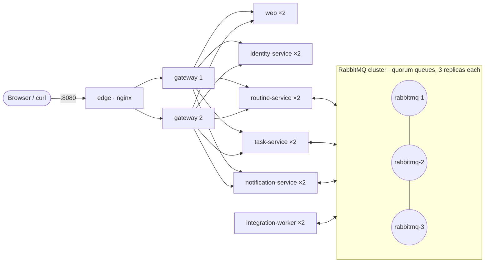

# Availability: single points of failure

A **single point of failure (SPOF)** is a component whose failure *on its own* takes a user-visible capability down.
This document lists every SPOF the platform had, how each one was removed, and the ones that remain on purpose.

The analysis followed two paths:

1. **Deployment**: every container in `compose.yaml`. How many copies run, and who depends on it?
2. **Runtime**: every dependency a request or message touches in code (`libs/service-kit`, `services/*/src/main.ts`).
   A component can run as several copies and still be a SPOF if the code only ever talks to one of them.

Everything below can be checked with `scripts/demo.sh failover` and `npm test`.

## 1. Topology after the fix



## 2. SPOFs found and removed

| # | Component | Before | Failure impact before | Fix | Verified by |
| --- | --- | --- | --- | --- | --- |
| 1 | **RabbitMQ** | 1 node | No action was dispatched and no result arrived. Every execution stalled (the outbox buffered, nothing moved on) | 3-node cluster (`rabbitmq-1..3`), quorum queues with 3 replicas, clients know all nodes | `failover` step 1: the queue leader is killed mid-run, the run still completes |
| 2 | **Classic DLQ / retry / unrouted queues** | classic queues (live on one node) | While their node was down, publishes to them were *confirmed and dropped*: silent loss of retries and dead letters | All are quorum queues now (`definitions.json`, `broker.ts`). DLQs have `x-delivery-limit: -1` so peeking never drops a message | `/api/queues`: 29/29 queues quorum, 3 replicas |
| 3 | **Token key cache** (code) | jose refetched the JWKS every 10 min and failed hard | identity-service down for more than 10 min → **every** API call on **every** service returned 401 | Last-known-good key set: if the refresh fails, the last fetched keys keep verifying (`auth.ts`) | `libs/service-kit/test/auth.test.ts` |
| 4 | **gateway** | 1 instance, owned the public port | UI and API unreachable | 2 replicas behind the `edge` load balancer; the gateway retries idempotent requests when a replica drops a connection | `failover` step 2: 100/100 requests OK while a gateway is killed |
| 5 | **identity-service** | 1 instance | No login, no JWKS for services that start up | 2 replicas; they share the signing key through `identity-db` | `failover` step 2 (new login after a kill) and step 3 |
| 6 | **routine-service** | 1 instance | No API for routines, no orchestration, no scheduler | 2 replicas; outbox relay, scheduler and migrations were already replica-safe (`SKIP LOCKED`, unique slots, advisory lock) | `failover` step 2 |
| 7 | **task- / notification-service** | 1 instance each | Their actions waited, their API was down | 2 replicas each, competing consumers on the same queue | `failover` step 2 |
| 8 | **web** | 1 instance | UI unreachable | 2 replicas | `failover` step 2 |
| 9 | **Management API in the gateway** | one fixed node | System status reported "broker down" when that one node was down | Asks the next node (`RABBITMQ_MANAGEMENT_URL` lists all three); the status shows `n/3 nodes` | `failover` step 1 |

A related fix came out of testing these SPOFs. When *all* replicas of a service are down, the gateway used to answer
`500 internal_error`. It now keeps the proxy's `503 upstream_unavailable` (`http.ts`), which clients may retry.

### How the fixes work

**Broker cluster.** The nodes find each other through a static list (`cluster_formation.classic_config`). A quorum
queue replicates every message to a majority of its members (Raft) before it confirms the publish, so with 3 replicas it
survives the loss of any one node, the leader included. Queues from `definitions.json` are declared while the cluster
is still forming and start with fewer members. *Continuous membership reconciliation* grows them to 3 replicas as soon
as the other nodes join. `pause_minority` stops a node that gets cut off from the other two from accepting writes it
cannot replicate. `amqp-connection-manager` gets all three URLs (`AMQP_URL`, comma-separated) and moves to the next
node on a disconnect. Consumers re-register there within about 2 s.

**Why the classic queues had to go.** A classic queue exists on exactly one node. A cluster does not change that. RabbitMQ 4
no longer mirrors classic queues. So the DLQs, the retry queues (TTL + dead-lettering back into the work queue) and
the queue for unrouted actions each tied part of the reliability path to one node. Quorum queues support TTL and
dead-lettering, so the retry mechanism works unchanged.

**Edge + replicated gateway.** Only one process can own port 8080 on a host, so *something* must sit there. That
job is now done by the `edge`: an nginx that only forwards (`infra/edge/nginx.conf`, about 30 lines, no auth, no logic, no
dependencies). Everything that can fail for application reasons (token check, routing, status) lives in the replicated
gateway. nginx re-resolves `gateway` every 2 s, so restarted or scaled replicas are picked up. A request to a replica that
is gone moves on to the next one. POST/PATCH/DELETE requests are never repeated once they have reached a gateway, so
failover cannot double a write.

**Key cache.** jose treats its `cacheMaxAge` as a hard expiry: once the cache is stale, it refetches *before* it checks
the cached keys, and it fails if identity-service is unreachable. The verifier now remembers the last successfully
fetched key set and falls back to it. After a failed refresh it waits 5 s before the next attempt, so requests do not
each wait for a timeout. It still rejects a key that a *reachable* identity-service no longer publishes, so key rotation
keeps working.

## 3. What remains, on purpose

| Component | Why it is still single | Blast radius | Mitigation in place | Production path |
| --- | --- | --- | --- | --- |
| **PostgreSQL** (one per service) | Automatic failover needs a replication manager (Patroni + etcd, or a managed service). That is five clusters, and `pg` has no multi-host connection strings | Only the owning service. Database per service keeps the failure inside one bounded context. Messages for it wait in the broker and are retried (1 s → 5 s → 15 s). `routine-db` is the most critical one: no new runs, no progress | Durable volumes, `restart: unless-stopped`, `/ready` checks the DB, services wait for the DB on start | Managed Postgres with a standby in another zone (RDS Multi-AZ, Cloud SQL HA) or CloudNativePG on Kubernetes |
| **edge** | One process owns the public port per host | UI/API unreachable until Docker restarts it (seconds) | Config-only, stateless, no dependencies. The part with the least that can fail | Two edge hosts with a floating IP (keepalived), or a cloud load balancer |
| **Docker host** | Compose runs on one machine | Everything | – | Several nodes with an orchestrator (Kubernetes, Swarm): replicas spread across nodes, broker nodes on separate nodes |
| **Jaeger** | In-memory, not in the request path | Only traces. Span export is asynchronous, and requests do not wait for it | – | Collector with persistent storage |
| **mock-external** | Stands in for third-party APIs, not part of the platform | Actions of the affected type | Retries, then `FAILED` with a clear error | – (third party) |

Limits of the fixes:

* **Quorum = majority.** 3 broker nodes tolerate **one** failure. With two nodes down, the queues are unavailable; the
  outbox keeps every state change and publishes it once a majority is back.
* **Right after the first start** the queues declared while the cluster was forming still get their missing
  replicas (a few seconds). A node lost in that window takes the queues it led with it until it is back.
  `scripts/demo.sh failover` waits for all replicas before it kills a node.
* **Cold start during an identity outage.** A service replica that *starts* while identity-service is down has not
  fetched any keys yet and rejects tokens until identity-service is back. Replicas that were already running keep
  working.
* **Moving from the single-node broker** starts the cluster with new volumes (`rabbitmq-1-data`…). Messages still in the
  old broker are not carried over. Drain the queues before switching, then remove the old volume with
  `docker volume rm routine_rabbitmq-data`.

## 4. Cost

| | Before | After |
| --- | --- | --- |
| Containers | 16 | 25 (+2 broker nodes, +1 edge, +6 service replicas) |
| Memory of the running stack | – | ≈ 1.5 GiB (measured with `docker stats`, idle) |
| Configuration | – | `SERVICE_REPLICAS` (default 2) scales all platform services at once. With `1`, each service runs once again on a machine with little memory; the broker cluster stays |

## 5. Verify

```bash
docker compose up -d --build --wait
scripts/demo.sh failover   # kill the broker leader mid-run, kill one replica of every service under traffic, stop identity
npm test                   # includes the key-cache fallback (libs/service-kit/test/auth.test.ts)
```
