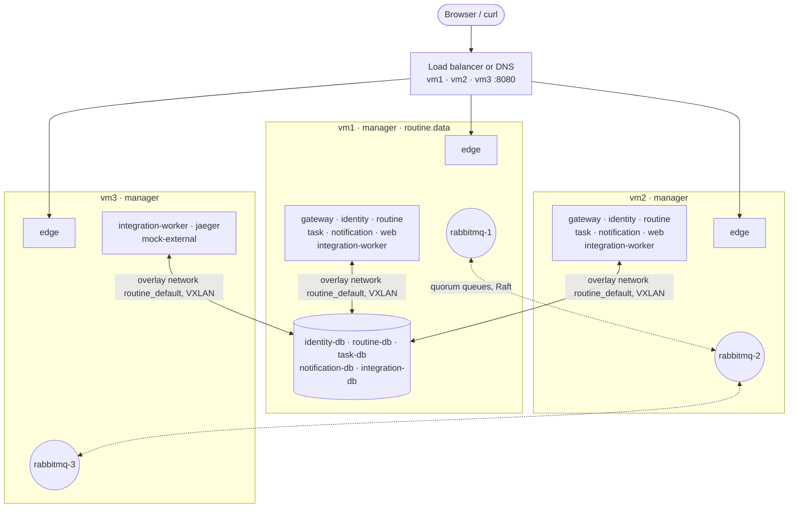

# Deployment on three VMs

`compose.yaml` runs the whole platform on **one** host (development, demo). This document covers the
production-like variant: the same containers spread over **three VMs**, so that losing a whole VM does
not take the platform down. The deployment is automated: one command, run from your own machine.

```bash
cp deploy/vms.env.example deploy/vms.env   # enter your three VMs
deploy/deploy.sh                           # bootstrap → swarm → images → stack → verify
```

## 1. Target topology



*Example placement: Swarm decides where the stateless replicas run. It keeps the two replicas of every service
on different VMs and moves them when a VM fails.*

| What | Where | Why |
| --- | --- | --- |
| Swarm managers | all 3 VMs | The swarm's own control plane (Raft) tolerates the loss of one VM |
| `edge` (nginx) | every VM (`mode: global`), port **8080** | Each VM can take requests; a load balancer / DNS in front spreads them |
| `rabbitmq-1..3` | one per VM (label `routine.rabbitmq=N`) | 3 replicas per quorum queue, one per VM – one VM can fail |
| gateway, identity, routine, task, notification, web | 2 replicas each, `max_replicas_per_node: 1` | Never both replicas on the same VM |
| integration-worker | 3 replicas, anywhere | Competing consumers, scale freely |
| 5 PostgreSQL databases | vm1 (label `routine.data=true`) | A volume lives on one VM; pinning keeps the data where the database runs |
| jaeger, mock-external | anywhere, 1 replica | Not in the critical path; rescheduled on VM failure (Jaeger loses its in-memory traces) |

## 2. Why Docker Swarm

| Option | Verdict |
| --- | --- |
| **Docker Swarm** (chosen) | Built into Docker – no extra software on the VMs. Reads the compose format we already have. Spreads replicas over VMs, restarts and reschedules them, rolling updates with rollback, overlay network across VMs, service discovery by name. |
| Kubernetes (k3s) | More powerful (operators for Postgres HA, e.g. CloudNativePG), but every service needs new manifests and the team has to learn and run a second system. Overkill for three VMs in this project. |
| Compose on every VM + Ansible | Every VM would be its own island: service names do not resolve across VMs, so every connection would have to be wired to fixed IPs, and nothing reschedules a service when a VM dies. |

## 3. Requirements

**VMs** (3×): Linux with systemd (recommended: Ubuntu 24.04 LTS; so far tested only on simulated VMs, see §8), 2 vCPU, 4 GB RAM, 20 GB disk, in the same
network with fixed IP addresses. On your machine: `docker` CLI, `ssh`, `git`, `curl`, `jq`, `openssl`.

**Access**: SSH login with a key (`ssh ubuntu@10.0.0.11` works without a password) and `sudo` without a password
(the default on cloud images). `deploy.sh bootstrap` installs Docker from the distribution's signed package
(`apt-get install docker.io`, Debian/Ubuntu) and adds the user to the `docker` group. On other distributions,
install Docker yourself first – bootstrap then skips the VM.

**Network**: open these ports between the VMs, and the public ones to your users:

| Port | Protocol | Between | Purpose |
| --- | --- | --- | --- |
| 2377 | TCP | VMs | Swarm management (Raft) |
| 7946 | TCP + UDP | VMs | Swarm node gossip |
| 4789 | UDP | VMs | Overlay network (VXLAN) – all service traffic between VMs |
| 22 | TCP | your machine → VMs | SSH (deploy.sh talks to Docker over SSH) |
| 8080 | TCP | users → VMs | UI and API (edge) |
| 15672 | TCP | **admins only** → VMs | RabbitMQ management of the node on that VM (password from the secrets file) |
| 16686 | TCP | **admins only** → VMs | Jaeger – has **no login**, so never open it to users or the internet |

Everything else (databases, broker ports 5672/4369/25672, mock-external) stays inside the overlay network and is
not published. Restrict 2377/7946/4789 to the three VMs. Swarm encrypts its control plane (mutual TLS) and
gossip, but not the service traffic on 4789/udp (VXLAN) – on a network you do not trust, add
`driver_opts: { encrypted: "true" }` to the network in `deploy/stack.yml` (IPsec; also allow IP protocol 50/ESP
between the VMs). Not enabled by default because it is untested in this setup.

## 4. Automated deployment

1. **Inventory**: `cp deploy/vms.env.example deploy/vms.env` and enter the SSH targets of the three VMs.
   `deploy/vms.env` is in `.gitignore`.
2. **Run** `deploy/deploy.sh` (or `npm run deploy:vms`). Every step is idempotent: run it again after a failure or
   after a code change.

| Step | Command | What happens |
| --- | --- | --- |
| 1 | `deploy.sh bootstrap` | Installs Docker on every VM that does not have it (apt package `docker.io`) |
| 2 | `deploy.sh swarm` | `swarm init` on vm1, vm2 and vm3 join as **managers**; node labels `routine.rabbitmq=1..3` and `routine.data=true` (vm1) |
| 3 | `deploy.sh images` | Builds the 8 service images **on vm1** (native CPU architecture of the VMs; no registry needed) and streams them to vm2 and vm3 (`docker save \| docker load`). Tag = git commit, plus a content hash when there are uncommitted changes |
| 4 | `deploy.sh stack` | Generates the secrets on the first run (below). `docker stack deploy` of [`deploy/stack.yml`](../deploy/stack.yml); broker and edge configuration become Swarm *configs* (named by content hash). Waits until every service runs its desired replicas and is healthy, then until **every quorum queue has a replica on every VM** (`rabbitmq-queues grow`) – only then may a VM fail |
| 5 | `deploy.sh verify` | Runs the main workflow (`scripts/demo.sh main`) against the deployed system and checks that every VM answers on :8080 |

Afterwards: UI on `http://<any VM>:8080` (`demo@routine.local` / `demo12345`), RabbitMQ on `http://<VM>:15672`
(user `routine`, password `RABBITMQ_PASSWORD` from the secrets file), Jaeger on `http://<any VM>:16686`.

### Secrets

The single-host `compose.yaml` uses well-known development passwords (`routine`/`routine` …). The VM deployment
never does: on its first run `deploy.sh` writes random values (`openssl rand`) to `deploy/vms.secrets.env` next to
the inventory – mode 600, in `.gitignore` – and the stack refuses to deploy if one is missing (`${VAR:?}`).

| Secret | Used for |
| --- | --- |
| `RABBITMQ_PASSWORD` | broker user `routine` (services, management UI); written into a local copy of the broker definitions (`deploy/.generated/`, also ignored) |
| `RABBITMQ_ERLANG_COOKIE` | shared secret of the broker nodes – whoever has it controls the cluster |
| `<SERVICE>_DB_PASSWORD` (5×) | one password per database |

**Keep the secrets file** (e.g. in your password manager): PostgreSQL sets a password only when it creates the
database, so a regenerated file locks the services out of the existing data. The secrets reach the containers
as environment variables, visible to whoever can run `docker service inspect` on a manager – that is, to
the admins of the VMs. The demo account's password is public on purpose.

### Rehearse without VMs

`deploy/local-vms.sh up` starts three simulated VMs on your machine (Docker-in-Docker containers, each with its own
Docker daemon) plus a load balancer in front of them, and writes `deploy/local-vms.env`:

```bash
deploy/local-vms.sh up
INVENTORY=deploy/local-vms.env deploy/deploy.sh      # same script, same stack as for real VMs
open http://localhost:18080                          # UI through the load balancer
docker stop routine-vm3                              # "power off" a VM
deploy/local-vms.sh down
```

Needs about 6 GB of memory for Docker. The simulated VMs are containers, so tests there cover the deployment
logic but not the real network. See [§8](#8-tested).

## 5. Operation

All commands go to a manager, e.g. `export DOCKER_HOST=ssh://ubuntu@10.0.0.11`.

| Task | Command |
| --- | --- |
| Status: nodes, replicas, placement | `deploy/deploy.sh status` |
| Deploy a new version (rolling, zero downtime) | `deploy/deploy.sh images stack` → each service is updated one replica at a time (`order: start-first`); a replica that does not become healthy rolls back automatically |
| Roll back a service by hand | `docker service rollback routine_routine-service` |
| Scale the worker | `docker service scale routine_integration-worker=6` |
| Logs of a service (all replicas, all VMs) | `docker service logs -f routine_routine-service` |
| Change configuration (e.g. evolution demo) | `EXECUTION_COMPLETED_FORMAT=expand deploy/deploy.sh stack` – redeploys only the services whose configuration changed |
| Take a VM out for maintenance | `docker node update --availability drain vm2` → replicas move away; afterwards `--availability active` |
| Remove the stack (data stays) | `deploy/deploy.sh destroy` |

### Demo scenarios on the VMs

`scripts/demo.sh` scenarios that only use HTTP run unchanged against the VMs:
`GATEWAY=http://10.0.0.11:8080 RABBIT=http://10.0.0.11:15672 scripts/demo.sh main` (also `retry`, `idempotency`,
`webhook`, `schedule`). The scenarios that stop containers use `docker compose` and belong to the single-host
setup. On the VMs, the same effects come from Swarm:

| Scenario | On the VMs |
| --- | --- |
| Resilience (consumer down, messages wait) | `docker service scale routine_integration-worker=0`, trigger a routine, watch the queue on :15672, `docker service scale routine_integration-worker=3` |
| Scaling | `docker service scale routine_integration-worker=6` |
| Failover | Power off a VM (or `sudo systemctl stop docker` on it) |

## 6. Failure behaviour

| Failure | What happens | Recovery |
| --- | --- | --- |
| A replica crashes | Swarm restarts it; the other replica serves meanwhile | automatic |
| vm2 or vm3 fails | Its edge drops out of the load balancer; broker keeps 2/3 nodes (majority); Swarm starts the lost replicas on the remaining VMs | automatic; when the VM comes back, its broker node rejoins |
| vm1 fails | As above, **plus** the databases are gone: logins, routines and tasks are unavailable until vm1 is back | restart vm1 – data is on its volumes |
| Two VMs fail | Broker has no majority: queues stop (the outbox keeps every state change); Swarm managers lose quorum | bring one VM back |

vm1 is the remaining single point of failure: it holds all five database volumes. Spreading the databases over the
VMs would not remove that – every VM would then hold *some* critical data, so any VM loss would break something.
Pinning them to one VM means vm2 and vm3 can fail without any impact. The real fix is a replicated database
(see [availability.md §3](availability.md#3-what-remains-on-purpose)).

## 7. What is not automated, and why

| Step | Why it is not in `deploy.sh` | What to do |
| --- | --- | --- |
| Creating the VMs | Depends on the platform (TBZ lab, VMware, Proxmox, a cloud) – there is no common API | Create 3 Ubuntu VMs with the specs from §3, then run `deploy.sh` |
| Firewall / security groups | Also platform-specific (cloud security group, `ufw`, a lab firewall) and outside the VMs' Docker | Open the ports from §3 |
| Load balancer or DNS in front of the VMs | Needs infrastructure outside the VMs (cloud LB, keepalived with a floating IP, or DNS with three A records) | Point it at `vm1..3:8080` with a health check on `/edge/health`. Without it, users use one VM's address and switch by hand if that VM is down |
| TLS certificates | Need a domain name | Terminate TLS at the load balancer |

## 8. Tested

On three simulated VMs (`deploy/local-vms.sh`, Docker-in-Docker), 2026-09-25:

| Test | Result |
| --- | --- |
| `deploy.sh all` on fresh VMs | swarm, images, stack, replication check and main workflow in ≈ 2 min |
| Rolling update of every service (new images) under load | 140/140 requests OK |
| vm2 powered off under load | 150/150 requests OK, none slower than 1 s; main workflow `COMPLETED` right after |
| vm3 powered off (it led every queue), watched for 3 min | broker 2/3 nodes throughout; 179 of 180 requests OK (the failed one came seconds after the test host woke from sleep); main workflow `COMPLETED` |
| vm3 powered on again | broker back to 3/3 within 60 s, all 29 queues with 3 replicas online, main workflow `COMPLETED` |

Two findings from these tests are built into the deployment:

* A VM that fails *right after* the deployment must not take queues with it that have not yet got all their replicas.
  `deploy.sh stack` therefore waits until every quorum queue has a replica on every VM.
* Swarm lists a task in service DNS only once it is healthy, but a RabbitMQ node only finishes booting once it
  has found its peers by DNS. With the full readiness check as healthcheck, the three nodes waited for each other
  forever. The stack uses `rabbitmq-diagnostics ping` instead (see the comment in `deploy/stack.yml`).

## 9. Troubleshooting

| Symptom | Cause / fix |
| --- | --- |
| `deploy.sh stack` waits forever for `rabbitmq-N` | The broker nodes cannot reach each other: ports 4789/udp and 7946 between the VMs (§3). Check with `docker service logs routine_rabbitmq-1` |
| A service shows `0/2`, `docker service ps --no-trunc routine_<svc>` says *No such image* | The image is missing on that VM – run `deploy.sh images` again |
| Services cannot reach each other across VMs, but work on the same VM | Overlay traffic is blocked (4789/udp) or the MTU is too small (some clouds: VXLAN needs 50 bytes; create the network with `com.docker.network.driver.mtu=1450`) |
| `port is already allocated` for the edge after changing how port 8080 is published | A published port cannot switch between routing mesh and host mode in place: `docker service rm routine_edge`, then `deploy.sh stack` |
| `password authentication failed` / broker login refused after redeploying | The secrets file was lost or regenerated, but the volumes still hold the old passwords. Restore the file – or, if the data may go, `deploy.sh destroy` and remove the volumes on the VMs |
| Replicas show e.g. `3/2` after a VM failure | Swarm still counts the tasks on the unreachable VM until it is back or removed – harmless |
