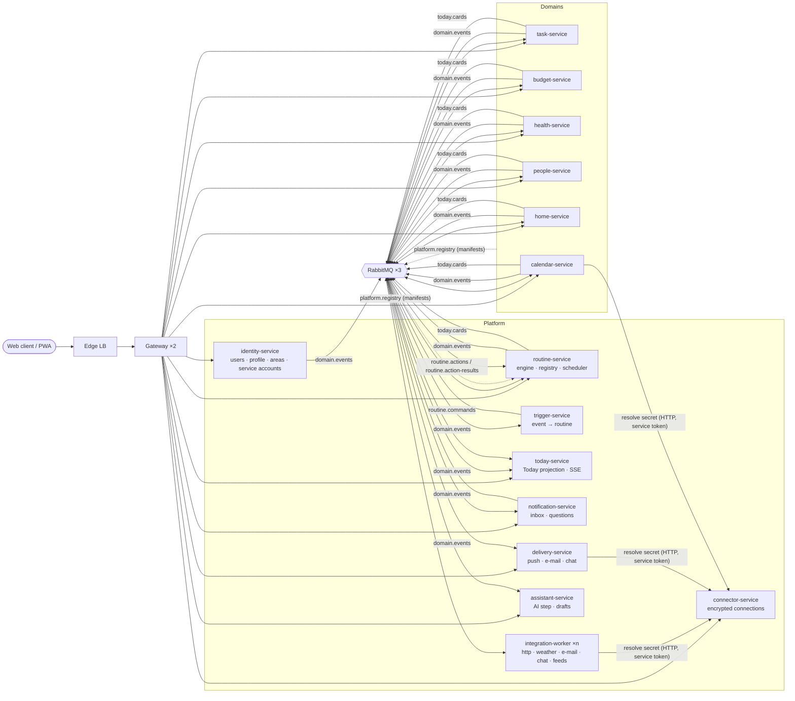

# 03 – Architecture

v2 keeps every v1 principle (one database per service, contracts first, at-least-once
messaging with idempotent consumers, transactional outbox, orchestration in the routine
service, replicas with no single point of failure) and extends the landscape along one
idea: **each domain of life is a service that publishes a manifest.**

---

## 1. Target landscape

## 2. Service catalogue

| Service | Status | Responsibility | Owns (DB) | Spec |
| --- | --- | --- | --- | --- |
| edge | v1 | Load balancer | – | – |
| gateway | changed | Routing, token check, system/admin endpoints, DLQ replay, SSE pass-through | – | [gateway](services/gateway.md) |
| web | changed | Web client, PWA, service worker | – | [07-web](07-web.md) |
| identity-service | changed | Users, login, **profile, areas, enabled domains, roles, service accounts, workspaces** | identity-db | [identity](services/identity-service.md) |
| routine-service | changed | Routines, engine, scheduler, **registry, catalog, versions, resume, human steps, event starts** | routine-db | [routine](services/routine-service.md) |
| task-service | changed | Tasks, lists, **inbox, snooze, edit, human steps, domain events, Today cards** | task-db | [task](services/task-service.md) |
| notification-service | changed | Inbox, **questions (ask me), domain events** | notification-db | [notification](services/notification-service.md) |
| integration-worker | changed | External calls: **+ chat, feed, secrets resolution** | integration-db | [integration-worker](services/integration-worker.md) |
| **trigger-service** | new | Matches domain events to event-triggered routines | trigger-db | [trigger](services/trigger-service.md) |
| **today-service** | new | Projection of Today cards per user, SSE stream | today-db | [today](services/today-service.md) |
| **delivery-service** | new | Push, e-mail digest, chat delivery, quiet hours | delivery-db | [delivery](services/delivery-service.md) |
| **connector-service** | new | Encrypted connections (API keys, ICS URLs, webhooks) | connector-db | [connector](services/connector-service.md) |
| **assistant-service** | new | AI step, routine drafts, token ledger | assistant-db | [assistant](services/assistant-service.md) |
| **budget-service** | new | Accounts, transactions, budgets, bills, goals, imports | budget-db | [budget](services/budget-service.md) |
| **health-service** | new | Metrics, entries, check-ins | health-db | [health](services/health-service.md) |
| **people-service** | new | Persons, birthdays, interactions | people-db | [people](services/people-service.md) |
| **home-service** | new | Chores, shopping list, supplies | home-db | [home](services/home-service.md) |
| **calendar-service** | new | Read-only ICS import, event triggers | calendar-db | [calendar](services/calendar-service.md) |
| mock-external | changed | + mock mail, chat and ICS endpoints, AI mock | – | – |

## 3. Communication patterns

| From → to | Kind | Channel | Purpose |
| --- | --- | --- | --- |
| Client → gateway → services | sync HTTP | `/api/v1/**` | CRUD, queries, answers to human steps |
| Client ← today-service | SSE | `/api/v1/today/stream` | "Today changed" hints |
| routine-service → domains | async command | `routine.actions`, routing `action.<type>` | run a step |
| domains → routine-service | async result | `routine.action-results` | completed / failed / retry / **awaiting-user** |
| routine-service → domains | async command | `routine.actions`, type `ActionCancelRequested` | cancel an expired human step |
| any domain → everyone | async event | `domain.events`, routing = event type | state changes (pub/sub) |
| trigger-service → routine-service | async command | `routine.commands`, `routine.start` | start an event-triggered run |
| domains → today-service | async event | `today.cards` | upsert/remove Today cards |
| any service → routine-service | async event | `platform.registry` | manifest registration + heartbeat |
| workers → connector-service | sync HTTP, service token | `/internal/v1/resolve` | resolve secrets at execution time |
| today-service → domains | async command | `today.cards`, `card.resync` | ask domains to republish a user's cards |

**Orchestration vs. choreography stays as in v1:** the steps of a routine are orchestrated by
the routine service. Everything *around* routines (triggers, Today, delivery) is choreographed
over `domain.events`, and producers never know their consumers.

## 4. Data ownership

- Every service owns its database. No service reads another's tables. Cross-service data
  travels as **event-carried state** (events include what consumers need) or via the owner's
  API.
- **Owner scoping:** every row carries `owner_id`. In v2, `owner_id` means the **acting
  workspace**. A personal workspace's id **equals the user's id**, so every v1 row stays
  valid without migration ([services/identity-service.md §5](services/identity-service.md)).
- **Area references** (`area_id`) are stored by each domain on its own rows. Areas are owned
  by identity-service. Domains react to `area.archived` by clearing the reference.
- **Money** is stored as integer minor units (`amount_minor bigint`) plus ISO currency code.
- **Time:** all timestamps are `timestamptz` (UTC). Local-date semantics (due dates, "today",
  habits) use the user's time zone from the profile, carried in commands and events as
  `timezone` when needed.

## 5. Security

v1 rules stay (RS256 JWTs, verification in gateway **and** services, tenant filter on every
query, SSRF allow-list, webhook tokens). v2 adds:

| Topic | Rule |
| --- | --- |
| **Roles** | `users.role` ∈ `user`, `admin`. Tokens carry `roles`. System endpoints (DLQ, chaos, registry) require `admin`. The demo user is admin. |
| **Service accounts** | identity-service issues **service tokens** (client-credentials: `POST /api/v1/auth/service-token`, `aud: routine-internal`, `sub: service:<name>`, 15 min). `/internal/**` endpoints accept only service tokens from an allow-list. Secrets for service accounts come from env/Swarm secrets. |
| **Secrets** | Connection values are encrypted with AES-256-GCM (`CONNECTOR_MASTER_KEY`). Only workers resolve them, at execution time, per action. Values never enter routine definitions, run records, logs, outputs or Today cards. |
| **Sensitive domains** | Budget and Health never log amounts, values or payees (log ids only). Their events carry values only where a trigger filter needs them. |
| **AI** | Opt-in per user. Inputs above the size limit are rejected, not silently truncated. A token ledger enforces a monthly allowance. Mock provider in CI. |
| **Quick entry & imports** | Parsed server-side again, never trusted from the client. Imports are capped (5 MB, 5,000 rows). |
| **Share links** | Shared routine exports contain no ids, secrets or personal data (see [services/routine-service.md §7](services/routine-service.md)). |

## 6. Observability

- Every new service uses the service-kit chassis: pino logs with correlation id, OTel traces
  to Jaeger, `/health` + `/ready`.
- **Trace continuity:** `traceparent` travels on every message, as in v1. Event-triggered runs
  link to the trace of the event that started them (span link, not parent), so a Payday run
  shows the import that caused it.
- **Run waterfall** data comes from `execution_actions` timestamps (`dispatched_at`,
  `accepted_at`, `finished_at`) and `processed_by` (replica).

## 7. Availability and deployment

- Every platform and domain service runs **2 replicas** (`SERVICE_REPLICAS`), and all
  background loops stay replica-safe (`FOR UPDATE SKIP LOCKED`, unique slots, advisory locks),
  as in v1 ([../availability.md](../availability.md)).
- **Compose profiles** keep local development light:
  - default (no profile): v1 core + trigger, today, connector
  - `--profile domains`: budget, health, people, home, calendar
  - `--profile presence`: delivery-service
  - `--profile ai`: assistant-service
  - `--profile all`: everything
- **Databases:** one Postgres *database and role* per service. For the local stack the new
  services' databases are co-hosted on one `domains-db` instance (separate databases, separate
  credentials, no cross-database access), so memory stays reasonable. In the Swarm stack
  each gets its own instance, like v1. (ADR-12)
- **Swarm / VMs:** `deploy/stack.yml` gains every new service with the same placement rules
  as v1 (two replicas, never on the same VM). A CI workflow per new service reuses
  `.github/workflows/_node-service.yml`.

## 8. Decisions (ADRs)

| # | Decision | Why | Rejected alternative |
| --- | --- | --- | --- |
| ADR-01 | **Product v2, API path stays `/api/v1`**, all changes additive | v1 contract rule: additive changes stay in v1. No client or script breaks. | `/api/v2` everywhere (needless duplication) |
| ADR-02 | **Domains describe themselves with manifests**, registered over the broker (`platform.registry`) | A new domain needs no change in routine-service, web or broker definitions: the point of the architecture | Hard-coded catalogues (v1), static manifest files in `contracts/` (needs routine-service redeploy) |
| ADR-03 | **Capability type = `<prefix>.<name>`**, camelCase name, doubles as routing key | Keeps v1 routing (`action.<type>`) and v1 types valid. Two segments keep bindings exact. | Three-segment types (`budget.transaction.record`) that break the v1 schema pattern |
| ADR-04 | **Domain services declare their own queues and bindings** (from their manifest) before registering | Adding a domain needs no infra change. Safe because routines can only use registered (therefore bound) capabilities. v1 queues stay in `definitions.json`. | All topology in `definitions.json` |
| ADR-05 | **Values ("Get…") travel through the broker** like actions, flagged `sideEffects: false` | One execution path, one retry/idempotency story. The engine may run them in test runs. | Synchronous HTTP from the engine (couples routine-service to every domain's availability) |
| ADR-06 | **Human steps are a result protocol, not an engine feature**: the domain answers `ActionAwaitingUser`, later `ActionCompleted` | Any domain can offer human steps (tasks, questions, check-ins). The engine only learns one new status. | Engine-owned "manual step" (would need its own UI data and couples the engine to tasks) |
| ADR-07 | **Event triggers live in a separate trigger-service** that keeps its own subscription projection | Consumes the high-volume `domain.events` stream without loading the routine DB. Scales and fails independently. | Matching inside routine-service |
| ADR-08 | **Event starts are idempotent via `idempotencyKey = event:<messageId>`** on the existing `UNIQUE (routine_id, idempotency_key)` | Reuses v1's guarantee. Duplicate events never start a second run. | A dedupe table in trigger-service only |
| ADR-09 | **Today is a CQRS projection** fed by generic Today cards that domains publish | Today works without knowing any domain. Adding a domain adds cards, not code. Eventual consistency is visible and demonstrable. | Gateway fan-out on every page load |
| ADR-10 | **Every domain service uses a transactional outbox** (moved into service-kit) | Domain events caused by HTTP writes (tick a task) must not be lost or phantom (dual write) | Publish after commit (v1 workers can do this only because they answer commands) |
| ADR-11 | **Secrets are resolved by workers, never by the engine** (`{{secrets.name}}` stays literal until the worker) | Secrets never enter routine-db, run records or logs | Engine-side resolution |
| ADR-12 | **Local dev co-hosts new domain databases on one Postgres instance** (separate DBs and roles) | Twelve Postgres containers exceed laptop memory. Autonomy is kept at database/role level. | One container per DB locally |
| ADR-13 | **Workspaces reuse `owner_id`**: personal workspace id = user id | Shared workspaces arrive without migrating any v1 row | New `workspace_id` column in every table |
| ADR-14 | **AI via `@anthropic-ai/sdk`, model `claude-opus-5`** (configurable), structured outputs + validation by the routine service | Drafts are always validated by the same code as hand-made routines. The AI can't produce anything the editor couldn't. | Free-form JSON parsing |
| ADR-15 | **Routine never moves money**: payments and transfers are human steps | Safety, liability, no bank write access | Bank write APIs |
| ADR-16 | **Server-sent events for Today**, polling stays as fallback | One-way hints suffice, and SSE passes through the gateway proxy without a new protocol | WebSockets |
