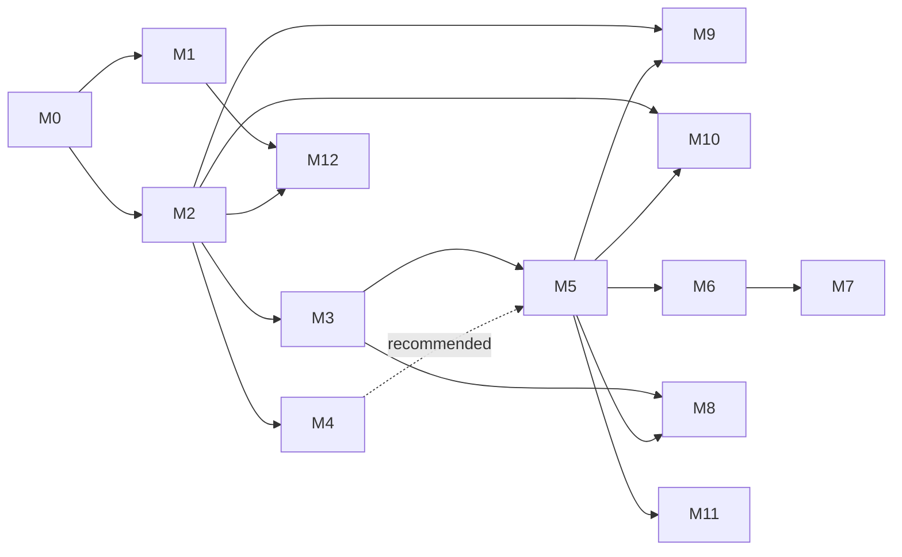

# 08 – Roadmap

Thirteen milestones. Each ends with something a person can **see and demo**. Each is split
into work packages (`Mx-nn`) small enough for one agent session and one commit (or a few,
see [10-quality.md §4](10-quality.md)).

## 1. Milestones

| # | Milestone | You can see… | Depends on | Size |
| --- | --- | --- | --- | --- |
| [M0](milestones/M0-foundations.md) | Foundations | nothing yet: the chassis (outbox in kit, manifests types, roles, service tokens, contracts) | – | M |
| [M1](milestones/M1-trust.md) | Trust | *Retry from here*, plain-language failures, routine health, version history, test a step, DLQ replay, demo scenarios on Infrastructure | M0 | L |
| [M2](milestones/M2-domain-platform.md) | Domain platform | the registry on Infrastructure, a step picker grouped by domain with generated forms, task events | M0 | L |
| [M3](milestones/M3-humans-in-the-loop.md) | Humans in the loop | *Do yourself*, *Ask me*, checklists, *Wait*, run inputs, text and list steps | M2 | L |
| [M4](milestones/M4-event-triggers.md) | Event triggers | *When a task is completed…*, *When a routine fails…* | M2 | M |
| [M5](milestones/M5-today.md) | Today & the daily loop | **Today** as home, Inbox and capture, areas, domain toggles, onboarding, edit/snooze/repeat tasks, planning and review templates, habits, command palette | M3 (M4 recommended) | XL |
| [M6](milestones/M6-budget.md) | Budget | the Budget domain end to end, Payday | M5 | L |
| [M7](milestones/M7-health-people-home.md) | Health, People, Home | three more domains, cross-domain templates | M6 | L |
| [M8](milestones/M8-presence.md) | Presence | push (with answer buttons), e-mail digest, chat, quiet hours, installable app, Your week | M3, M5 | M |
| [M9](milestones/M9-reach.md) | Reach | Connections, calendar on Today, chat and feed steps, real weather, sun and holiday schedules, skip/pause, vacation mode | M2, M5 | L |
| [M10](milestones/M10-intelligence-sharing.md) | Intelligence & sharing | AI step, *Describe your routine*, suggestions, share links and import | M2, M5 | M |
| [M11](milestones/M11-together.md) | Together | shared workspaces | M5 | L |
| [M12](milestones/M12-systems-showcase.md) | Systems showcase | run waterfall, chaos switch, replica view, duplicate badges | M1, M2 | S |

Sizes: S ≈ 3–5 work packages, M ≈ 6–9, L ≈ 10–14, XL ≈ 15+.

## 2. Dependency graph

**Critical path:** M0 → M2 → M3 → M5 → M6. M1 and M4 can run in parallel with M2/M3 if two
agents work at once. They touch different files, except `engine.ts`, where M1 lands first.

## 3. Release points

| Release | Milestones | What it is |
| --- | --- | --- |
| **2.0-alpha** | M0–M4 | v1 made trustworthy and extensible: the platform release |
| **2.0-beta** | + M5, M6 | the personal management platform: Today, areas, Budget |
| **2.0** | + M7, M8, M9, M12 | full life coverage, presence, reach, systems showcase |
| **2.1** | M10, M11 | AI, sharing, workspaces |

## 4. What stays out of v2

Decided, so nobody builds them by accident: node/flowchart editor, notes and documents,
creating calendar events, projects with dependencies, goals/OKRs as objects, gamification
(points, levels, streak alarms), multi-currency, bank write access or payments, polling
triggers on arbitrary websites, native mobile apps (the PWA covers phones), an activity log
UI for workspaces.
